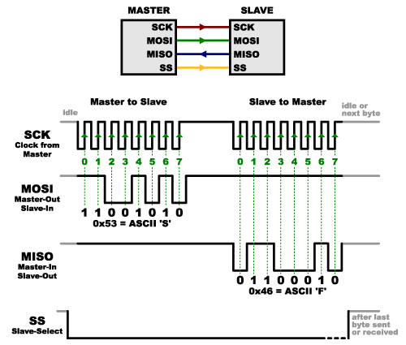
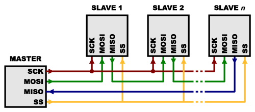

# SPI

source: https://it.wikipedia.org/wiki/Serial_Peripheral_Interface

source: https://learn.sparkfun.com/tutorials/serial-peripheral-interface-spi

Il Serial Peripheral Interface o SPI (pronuncia: ɛs pi aɪ o spaɪ) è un sistema di comunicazione tra un microcontrollore e altri circuiti integrati o tra più microcontrollori.

È un bus standard di comunicazione ideato dalla Motorola e sviluppato, in una sua variante, anche dalla National Semiconductor con il nome di bus Microwire (TM).

Il bus SPI presenta le seguenti caratteristiche:

* comunicazione di tipo seriale
* comunicazione sincrona per la presenza di un clock che coordina la trasmissione e ricezione dei singoli bit e determina la velocità di trasmissione
* full-duplex in quanto il "colloquio" può avvenire contemporaneamente in trasmissione e ricezione.
* velocità minima non definita a livello di specifiche
* velocità meassima determinata dalle caratteristiche dei dispostivi coinvolti nella comunicazione
* utilizza quattro fili per i segnali più riferimento di terra (ground) comune tra i dispositivi connessi.

## Applicazioni
Questo sistema di comunicazione di solito serve per lo scambio di dati tra dispositivi montati "sulla stessa scheda elettronica" (o comunque tra schede elettroniche vicine tra di loro) in quanto non prevede particolari accorgimenti hardware per trasferire informazioni tra dispositivi lontani connessi con cavi soggetti a disturbi.

Grazie alla semplictà di implementazione, il bus SPI è supportato da moltissimi dispositivi integrati. Rispetto al bus I2C, SPI richiede un numeor maggiore di linee, ma permette di raggiungere velocità di trasferimento maggiori (fino a 50 volte più veloce di I2C) ed è quindi preferito quando è necessario trasferire velocemente grandi quantità di dati. Ad esempio ADC, DAC e IC di comunicazione.

## Invio e Ricezione dei dati
La trasmissione avviene tra un dispositivo detto master e uno o più slave (letteralmente dall'inglese padrone e schiavo). Il master controlla il bus, emette il segnale di clock, decide quando iniziare e terminare la comunicazione. 
Un solo dispositivo può essere attivo sul bus con ruolo di mater, ma tutti i dispositivi collegati possono, in momenti diversi, assumere il ruolo di master. Il dispositivo master è quello che genera il clock.

Il protocollo utilizza 4 segnali che possono essere indicati con nomi diversi a seconda del produttore del dispositivo.

* **SCLK - SCK**: Serial Clock (emesso dal master)
* **SDI – MISO – SOMI – DI - SO**: Serial Data Input, Master Input Slave Output (ingresso per il master ed uscita per lo slave)
* **SDO – MOSI – SIMO – DO – SI**: Serial Data Output, Master Output Slave Input (uscita dal master)
* **CS – SS – nCS – nSS – STE**: Chip Select, Slave Select, emesso dal master per scegliere con quale dispositivo slave vuole comunicare. Il dispositivo selezionato è quello con linea CS a livello basso.

Il protocollo è "full-duplex": le linee per inviare comandi e ricevere dati sono separate ed è ad esempio possibile richiedere una nuova lettura da un sensore mentre si riceve il risultato della lettura precedente.

When data is sent from the master to a slave, it’s sent on a data line called MOSI, for “Master Out / Slave In”. If the slave needs to send a response back to the master, the master will continue to generate a prearranged number of clock cycles, and the slave will put the data onto a third data line called MISO, for “Master In / Slave Out”.

Notice we said “prearranged” in the above description. Because the master always generates the clock signal, it must know in advance when a slave needs to return data and how much data will be returned. This is very different than asynchronous serial, where random amounts of data can be sent in either direction at any time. In practice this isn’t a problem, as SPI is generally used to talk to sensors that have a very specific command structure. For example, if you send the command for “read data” to a device, you know that the device will always send you, for example, two bytes in return. (In cases where you might want to return a variable amount of data, you could always return one or two bytes specifying the length of the data and then have the master retrieve the full amount.)

Note that SPI is “full duplex” (has separate send and receive lines), and, thus, in certain situations, you can transmit and receive data at the same time (for example, requesting a new sensor reading while retrieving the data from the previous one). Your device’s datasheet will tell you if this is possible.

## Slave Select (SS) or Chip Select (CS) Line

There’s one last line you should be aware of, called SS for Slave Select. This tells the slave that it should wake up and receive / send data and is also used when multiple slaves are present to select the one you’d like to talk to.

The SS line is normally held high, which disconnects the slave from the SPI bus. (This type of logic is known as “active low,” and you’ll often see used it for enable and reset lines.) Just before data is sent to the slave, the line is brought low, which activates the slave. When you’re done using the slave, the line is made high again. In a shift register, this corresponds to the “latch” input, which transfers the received data to the output lines.

### Multiple Slave

There are two ways of connecting multiple slaves to an SPI bus:

In general, each slave will need a separate SS line. To talk to a particular slave, you’ll make that slave’s SS line low and keep the rest of them high (you don’t want two slaves activated at the same time, or they may both try to talk on the same MISO line resulting in garbled data). Lots of slaves will require lots of SS lines; if you’re running low on outputs, there are binary decoder chips that can multiply your SS outputs.

On the other hand, some parts prefer to be daisy-chained together, with the MISO (output) of one going to the MOSI (input) of the next. In this case, a single SS line goes to all the slaves. Once all the data is sent, the SS line is raised, which causes all the chips to be activated simultaneously. This is often used for daisy-chained shift registers and addressable LED drivers.

Note that, for this layout, data overflows from one slave to the next, so to send data to any one slave, you’ll need to transmit enough data to reach all of them. Also, keep in mind that the first piece of data you transmit will end up in the last slave.

This type of layout is typically used in output-only situations, such as driving LEDs where you don’t need to receive any data back. In these cases you can leave the master’s MISO line disconnected. However, if data does need to be returned to the master, you can do this by closing the daisy-chain loop (blue wire in the above diagram). Note that if you do this, the return data from slave 1 will need to pass through all the slaves before getting back to the master, so be sure to send enough receive commands to get the data you need.

### Operation Mode
SPI prevedede quattro "operation mode" e solitamente il dispositivo master adatta l'interfaccia alla modalità operativa supportata dal dispositivo slave.

TBC

In SPI, data shift and data latch are done opposite clock edges respectively. There is an advantage that when shift and latch operations are separated, critical timing between two operations can be avoided. Therfore timing consideration for IC design and board design can be relieved. But on the other hand there are four operation modes due to combination of clock polarity and clock phase, master IC must configure its SPI interface as an SPI mode that slave IC required.

http://elm-chan.org/docs/spi_e.html

## Using SPI
source: https://learn.sparkfun.com/tutorials/serial-peripheral-interface-spi

Many microcontrollers have built-in SPI peripherals that handle all the details of sending and receiving data, and can do so at very high speeds. The SPI protocol is also simple enough that you (yes, you!) can write your own routines to manipulate the I/O lines in the proper sequence to transfer data. (A good example is on the Wikipedia SPI page.)

