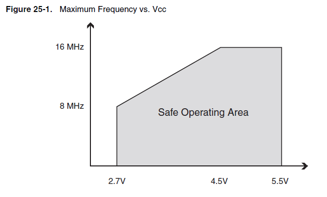

# Brownout Detection

Si berifica un brownout quando la tensione cala, ma l'alimetazione non viene interrotta del tutto (blackout). Il nome deriva dall'effetto che l'abbassamento di tensione determina sulle lampade ad incandescenza.

Nei sistemi di automazione, se l'alimentazione scende al di sotto del limite di tolleranza, potrebbero verificarsi transizioni di stato logico non previste potenzialmente in grado di innescare un comportamento imprevedibile del microcontrollore, con conseguente pericolo di danni a persone o cose. In questa situazione è ritenuto più sicuro riavviare il microcontrollore in modo da riportare il sistema in uno degli stati previsti in fase di progettazione.

## Soglia di Sicurezza
I valori di tensione di alimentazione accettabili sono solitamente riportati nel datasheet della CPU. Ad esempio nel caso di un ATMega8 è presente questo grafico che indica la soglia di sicurezza al variare della frequenza di clock.

Molti MCU prevedono un sistema di Brown Out Detection (BOD)implementato in Hardware, che esegue un reset del microcontrollere se la tensione scende al di sotto di una soglia di sicurezza. La soglia di innesco è solitamente configurabile.

I micorcontrollori AVR utilizzati per le schede Arduino sono dotati di un sistema di rilevamento dei brownout.
 

# Reference: 

http://electronics.stackexchange.com/questions/123396/in-what-situation-should-i-keep-the-brown-out-detection-feature-off-on-a-microco

http://electronics.stackexchange.com/questions/37561/what-is-a-brownout-condition

https://en.wikipedia.org/wiki/Brownout_(electricity)
