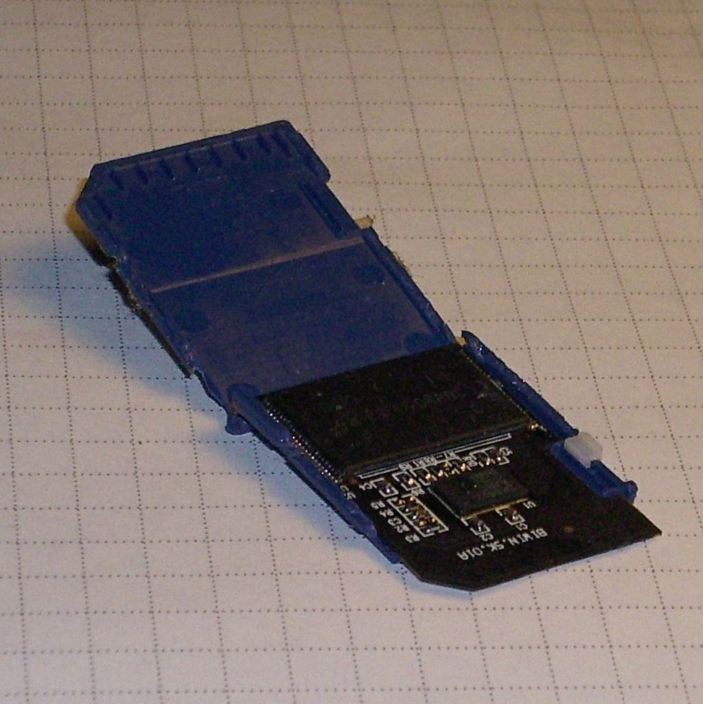
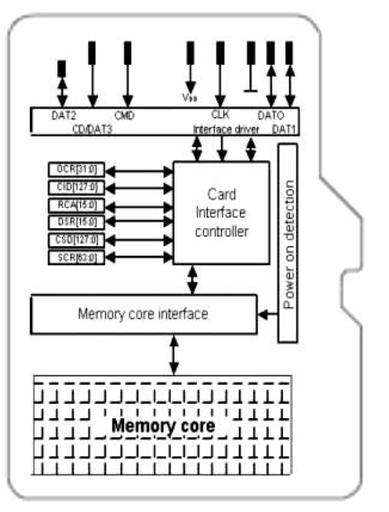
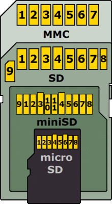
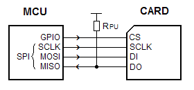
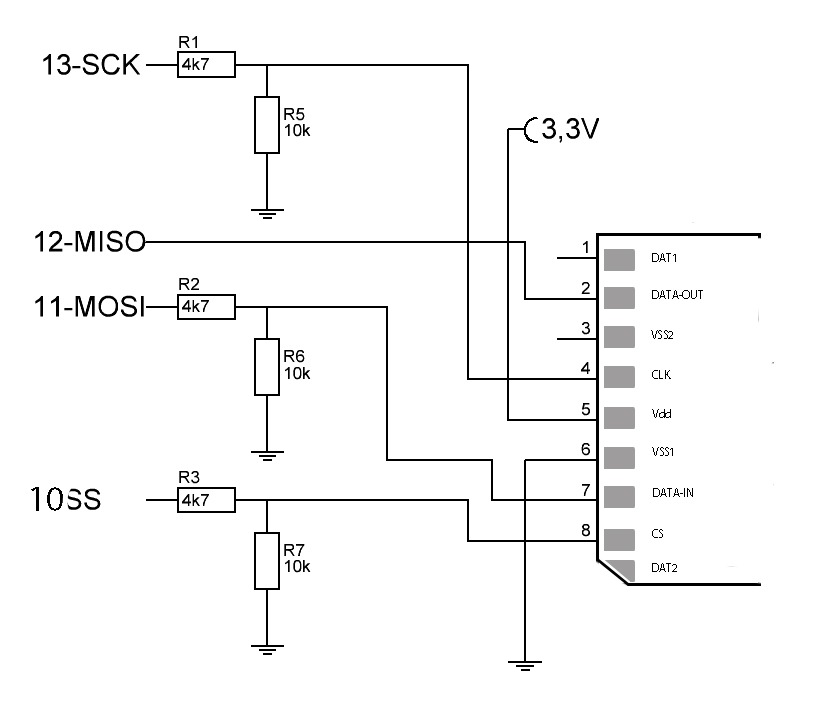
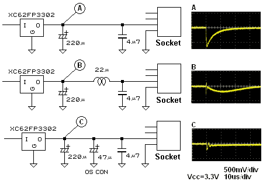

# SD Card Connection

Le memory card SD oltre ad una memoria NAND Flash contengono un microcontrollore che gestisce le comunicaizone verso altri dispositivi. 

Di Alessio Sbarbaro User_talk:Yoggysot - Opera propria, CC BY-SA 3.0, https://commons.wikimedia.org/w/index.php?curid=25125222

Tratta da Trascend TS256M 2GUSD Datasheet

Solitamente le memory card di tipo SD (anche miniSD e microSD) supportano tre diversi protocolli di accesso:

* One-bit SD mode
* Four-bit SD mode
* SPI mode

I diversi protocolli utilizzano gli stessi pin, ma per funzioni diverse.

Solitamente per leggere o scrivere una SD card con un microcontrollore si utilizza la modalità SPI, supportata dalla maggior parte dei microcontrollori e delle SD. Per collegare la SD card al microcontrollore esistono diverse soluzioni:

- utilizzare uno slot SD(MiniSD/MicroSD)
- utilizzare un scheda di espanzione che include un lettore SD card (es. Arduino Ethernet Shield)
- utilizzare un brekout module con slot SD card
- utilizzare un adattatore SD -> MiniSD -> MicroSD come se fosse uno slot

Solitamente gli slot SD in commercio sono di tipo SMD e non sono facimente utilizzabili a livello amatoriale su PCB o su breadboard. 

I breakout module sono invece sicuramente più facili da utilizzare e piuttosto economici (1-5€) e spesso includono anche uno stabilizzatore di tensione e un level shifter utili se si deve collegare il modulo ad una board a 5V (es. Arduino). Per le board con I/O a 3.3V questi componenti potrebbero essere superflui.

## Collegamento Diretto

Nota: I fili non devono essere saldati sulla miniSD/microSD, ma sull'adattore, che in questo modo può essere utilizzato come slot per miniSD/microSD. Inoltre in questo modo si evita il rischio di danneggiare la scheda saldando i fili.

Se si utilizza una board con livello di tensione 3.3V è possibile collegare la SD card direttamente ai pin della porta SPI senza componenti aggiuntivi. Con alcune SD l afase di inizializzaizone potrebbe fallire se non viene messa una resistenza di pull-up sul pin Data Out (DO), corrispondente alla linea MISO del protocollo SPI. 

### Collegamento diretto con MCU a 5V

La tensione sui pin della SD card non deve superare i 3,6V. Applicando una tensione di 5V la SD probabilmente sarà danneggiata in modo irreparabile.

Per collegare una SD Card direttamente ad una board a 5V tipo arduino è necessario prevedere almeno due tre partitori di tensione per convertire il la tensione 5V ad un valore compatibile con l'interfaccia della scheda SD. Ovviamente un utilizzando un level shifter/buffer si ottiene un risultato più affidabile. Molti breakoput module in commercio sono progettati per la connesione con MCU a 5V.

Collegamento diretto con partitori di tensione:

source: [Blog arduinodiy](https://arduinodiy.wordpress.com/2012/03/28/sd-card-on-arduino/)

Alcuni suggerimenti:

- mantenere al minimo la lunghezza dei fili. Se sono troppo lunghi si potrebbero verificare problemi, in particolare con velocità di trasmissione elevate.
- verificare sul datasheet della sheda SD che la corrente fornita sia sufficiente. Alcune schede sono in grado di fornire solo poche decine di milliampere sull'alimentazione a 3.3V, che potrebbero non essere sufficienti per tutte le schede SD.

## Inserimento ed estrazione "a caldo"
Se l'applicaizone prevede la possibilità estrarre o inserire la scheda SD "a caldo" durante il funzionamento è necessario inserire delle resistenze di pull-up/pull-down per evitare che le linee possano assumere valori fluttuanti fuori controllo.

Le linee DataIN e DataOut sono in stato normalmente alto e quindi le specifiche SD/MMC prevedono delle resistenze  di pull-up di valore compreso tra 50K e 100K homs According to SDC/MMC specs, from 50k to 100k ohms.
Il segnale di clock non è menzionato nelle specifiche, ma se esiste la possibilità che il pin sia in stato "floating" è opportuno inserire una resistenza di pull-down

Se la SD è connessa direttamente all'alimentazione della MCU, l'inserimento di una scheda SD potrebbe provocare un abbassamento della tensione sufficiente a far resettare il sistema di Brown Out Detection (BOD) con conseguente reset del microcontrollore.

http://elm-chan.org/docs/mmc/mmc_e.html
The MMC/SDC can hot insertion/removal but some considerations to the host circuit are needed to avoid an incorrect operation. For example, if the system power supply (Vcc) is tied to the card socket directly, the Vcc will dip at the instant of contact closed due to a charge current to the capacitor that built in the card. 'A' in the right image is the scope view and it shows that occureing a voltage dip of about 600 millivolts. This is a sufficient level to trigger a brown out detector. 'B' in the right image shows that an inductor is inserted to block the surge current, the voltage dip is reduced to 200 millivoits. A low ESR capacitor, such as OS-CON, can eliminate the voltage dip dratiscally like shown in 'C'. However the low ESR capacitor can cause an oscillation of LDO regulator.

# Riferimenti

[Wikipedia IT Secure Digital](https://it.wikipedia.org/wiki/Secure_Digital)
Trascend TS256M 2GUSD Datasheet

[How to Use MMC/SDC(]http://elm-chan.org/docs/mmc/mmc_e.html)

